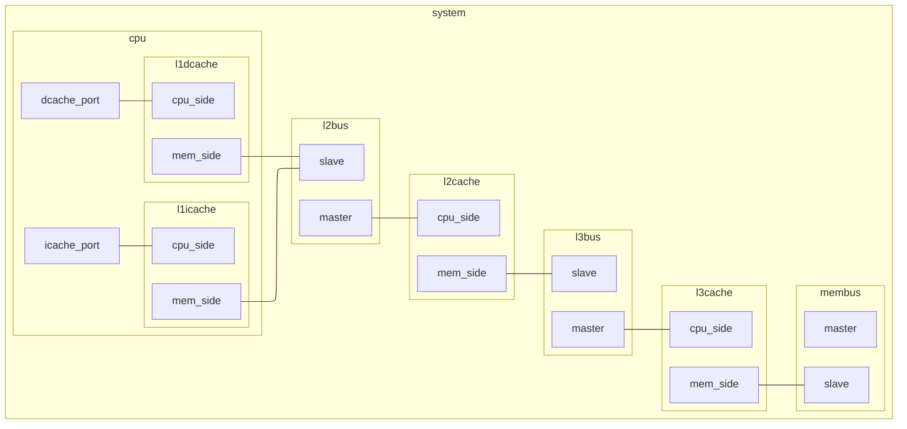

# Gem5-Practice

112-02 CE3001 : Computer Organization Final Project


## [▶️](https://github.com/RogelioKG/Gem5-Practice?tab=readme-ov-file#%EF%B8%8F-outline) Outline
+ [**Setting up the Project**](https://github.com/RogelioKG/Gem5-Practice?tab=readme-ov-file#%EF%B8%8F-setting-up-the-project)
+ [**Q2. Enable L3 cache**](https://github.com/RogelioKG/Gem5-Practice?tab=readme-ov-file#%EF%B8%8F-q2-enable-l3-cache)
+ [**Grading Criteria**](https://github.com/RogelioKG/Gem5-Practice?tab=readme-ov-file#%EF%B8%8F-grading-criteria)
+ [**Diagram**](https://github.com/RogelioKG/Gem5-Practice?tab=readme-ov-file#%EF%B8%8F-diagram)


## [⬆️](https://github.com/RogelioKG/Gem5-Practice?tab=readme-ov-file#%EF%B8%8F-outline) Setting up the Project

1. **Environment**
    > Ubuntu 18.04 LTS

2. **Toolkits**
    ```bash
    sudo apt install build-essential git m4 scons zlib1g zlib1g-dev libprotobuf-dev protobuf-compiler libprotoc-dev libgoogle-perftools-dev python3-dev python3-six python libboost-all-dev pkg-config
    ```

3. **Install gem5**
    > [download gem5](https://gem5.googlesource.com/public/gem5/+archive/525ce650e1a5bbe71c39d4b15598d6c003cc9f9e.tar.gz)

4. **Unzip and compile gem5**
    > [!CAUTION]
    > 在 gen5 目錄下

    > [!CAUTION]
    > 編譯之後位置就不能動 (編譯過程有使用到絕對路徑)
    ```bash
    scons build/X86/gem5.opt -j 4
    ```
    + `–j` : multithread 加速 (Optional) (arg: int)

5. **Clone NVmain**
    > [!CAUTION]
    > 把 NVmain 跟 gem5 放到同一個目錄下

    > [!NOTE]
    > 或者使用 `git submodule` 也可以
    ```bash
    git clone https://github.com/SEAL-UCSB/NVmain
    ```

6. **Comment `NVmain/SConscript`**
    > 把 36 行的 `from gem5_scons import Transform` 註解掉並存檔

7. **Compile NVmain**
    > [!CAUTION]
    > 在 NVmain 目錄下
    ```bash
    scons --build-type=fast
    ```

8. **Modify `gem5/configs/common/Options.py`**
    > 第 133 行加入以下程式並存檔
    ```py
    for arg in sys.argv:
      if arg[:9] == "--nvmain-":
        parser.add_option(arg, type="string", default="NULL", help="Set NVMain configuration value for a parameter")
    ```

9.  **Uncomment `NVmain/SConscript`**
    > 還原前面註解掉的 `from gem5_scons import Transform`

10. **Compile Together**
    > [!CAUTION]
    > 在 gen5 目錄下
    ```bash
    scons EXTRAS=../NVmain build/X86/gem5.opt
    ```


## [⬆️](https://github.com/RogelioKG/Gem5-Practice?tab=readme-ov-file#%EF%B8%8F-outline) Q2. Enable L3 cache

+ 修改檔案
  + [x] `gem5/configs/common/Options.py`
  + [x] `gem5/configs/common/Caches.py`
  + [x] `gem5/configs/common/CacheConfig.py`
  + [x] `gem5/src/mem/Xbar.py`
  + [x] `gem5/src/cpu/BaseCPU.py`

+ 注意
  > [!NOTE]
  > 前面四個檔案只是增加 L3 cache 的 parameter，照著 L2 cache 的設定去做模仿就可以。

  > [!NOTE]
  > `CacheConfig.py` 需要讓 L3 cache 連接整個 Gem5 系統，這邊要注意 L2 跟 L3 這兩個 cache 的關係，要讓系統在已使用 L2 cache 的情況下才能使用 L3 cache，所以要注意修改的時候有沒有滿足這個條件。

  > [!NOTE]
  > 細節 code 的部分，同學可以上網找資源關鍵字 Gem5 L3 cache 之類的。


## [⬆️](https://github.com/RogelioKG/Gem5-Practice?tab=readme-ov-file#%EF%B8%8F-outline) Grading Criteria
+ [x] Q1. **GEM5 + NVMAIN BUILD-UP** (40%)
    + **Answer** : 按照 PowerPoint 做 

+ [x] Q2. **Enable L3 last level cache in GEM5 + NVMAIN** (15%)
    + **Answer** : Modify [these files](https://github.com/RogelioKG/Gem5-Practice?tab=readme-ov-file#%EF%B8%8F-q2-enable-l3-cache)
    + **Goal** : 看到 _config.ini_ 裡面有 L3 cache 的資訊

+ [x] Q3. **Config last level cache to 2-way and full-way associative cache and test performance** (15%)
    + **Answer** : Option `--l3_assoc`. [Set to 1 indicates full-way associativity](https://old.gem5.org/Coherence-Protocol-Independent_Memory_Components.html) (search "set to 1")
    + **Goal** : 可用 miss rate 判斷是否成功
    + **Submit** : the log files for running the _quicksort.out_ using 2-way and full-way.

+ [x] Q4. **Modify last level cache policy based on frequency based replacement policy** (15%)
    + **Answer** : Modify `gem5/configs/common/Caches.py`
    + **Submit** : the log files for running the _quicksort.out_ or _multiply.out_ using original (LRU) & frequency based.
    + **Demo** : running the _quicksort.out_

+ [x] Q5. **Test the performance of write back and write through policy based on 4-way associative cache with isscc_pcm** (15%)
    > [!IMPORTANT]
    > gem5 預設使用 write back，[write through 要自己實做](https://www.mail-archive.com/gem5-users@gem5.org/msg16454.html)
    + **Answer** : Modify `gem5/src/mem/cache/base.cc` (maybe?)
    + **Goal** : 可用 write request 的數量判斷 write through 是否成功
    + **Submit** : the log files for running the _multiply.out_ using write through & write back.

+ [ ] **Bonus** (10%)
    > Design last level cache policy to reduce the energy consumption of pcm_based main memory\
    + **Answer** : ?
    + **Goal** : ?
    + **Submit** : the log files for running the _hello.out_ using baseline (LRU) & modified method.


## [⬆️](https://github.com/RogelioKG/Gem5-Practice?tab=readme-ov-file#%EF%B8%8F-outline) Diagram
